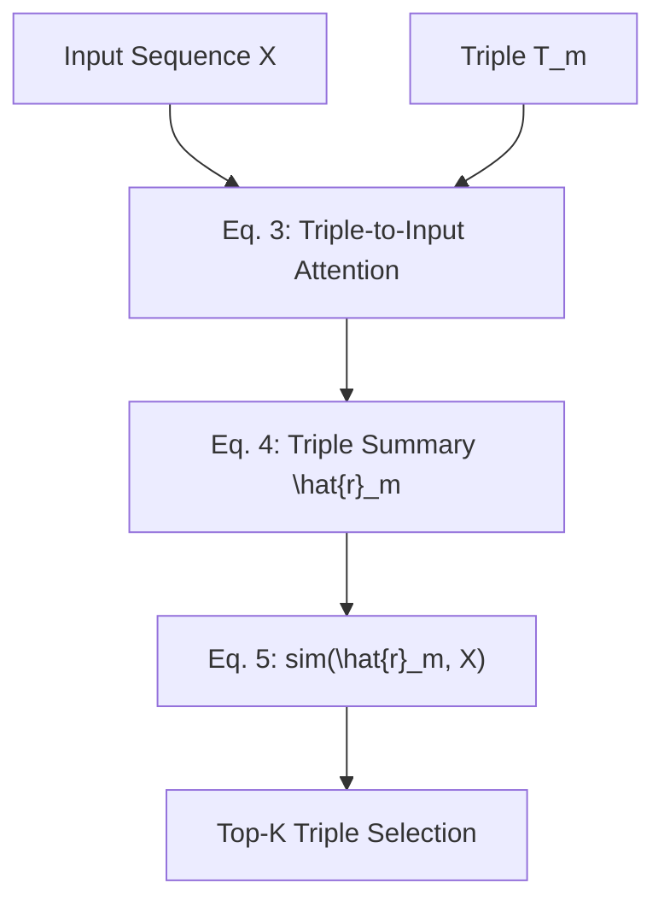
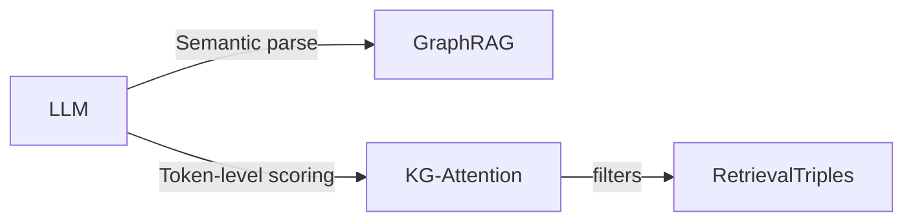

## 概述

- 本文与 GraphRAG 的核心差异在于检索阶段是否使用语义理解（GraphRAG 用 LLM 引导检索，而 KGA 是检索后再做语义过滤）。这与其在简单问答任务上表现不佳密切相关。
- KGA 的最大贡献不在于检索机制，而在于 inward aggregation，即使用 LLM 自身的 attention 机制去精细判断 KG 中哪些 triplet 与输入最相关，具体体现在公式 (3)(4)(5)。
- 我们补充推理出最终 LLM 的 working memory 有两种可能性，原文对此部分描述不清。
- 最后评估了该方法引入的额外计算与空间开销，发现虽然 attention 成本增加，但只要保留的 K 个 triplet 控制得当，KV 扩展仍是可控的。

原文：[KG-Attention](https://arxiv.org/pdf/2507.08704)

---

## 简单胶片版

### Slide 1: Core Critique of the Paper

> "KG-Attention's retrieval relies on lexical/entity matching, not semantic parsing, weakening downstream memory modeling"

* **Observation**: Underperforms on SimpleQuestions benchmark
* **Claim**: Due to lexical retrieval failure: 2-hop exhaustive matching fails to retrieve relevant entities
* **Issue**: Retrieval is not integrated with LLM’s semantic understanding
* **Implication**: Breaks the symmetry of the paper’s “attention/working memory” philosophy

**🧠 Additional Concern**:

* The paper uses Eq. (2) to enrich input tokens into $\hat{X}$ via triple-token attention
* However, it's unclear whether $\hat{X}$ or raw $X$ is passed to the final decoder
* If raw $X$ is used, it ignores enriched representations; if $\hat{X}$ is used, it risks being polluted by irrelevant triples (since Eq. 2 happens *before* Eq. 5 filtering)
* **Pros of using $X$**: cleaner context, no contamination from irrelevant triples
* **Pros of using $\hat{X}$**: enriched semantics, potentially better for complex reasoning
* This ambiguity introduces a tension between *memory precision* and *information utility*

---

### Slide 2: Comparison to Retrieval-based Systems

| Approach       | Retrieval Guided by        | Fusion Style          | Role of LLM                          |
| -------------- | -------------------------- | --------------------- | ------------------------------------ |
| **GraphRAG**   | LLM semantic query parsing | In-context w/ prompts | Semantic reasoning throughout        |
| **This Paper** | Lexical 2-hop match        | Attention as memory   | Semantic filtering *after* retrieval |

**Key Distinction**:

* GraphRAG uses LLM up front
* KG-Attention uses LLM *post hoc* to filter irrelevant triples

---

### Slide 3: Core Contribution — KG-Attention (Eq. 3/4/5, with Notation Explained)

#### Equation (3): Token-level Relevance from Triple to Input

$$
 r_m = \text{softmax}(Q_m K_X^T)
$$

* $Q_m \in \mathbb{R}^{L_m \times d}$: query from tokens of triple $T_m$ (length $L_m$)
* $K_X \in \mathbb{R}^{L_X \times d}$: key from input $X$ (length $L_X$)
* Result $r_m \in \mathbb{R}^{L_m \times L_X}$: token-level attention matrix
* Softmax is applied across $j$, the input token index → this yields relevance of input tokens *for each triple token*
* **Level**: Token-to-token (triple token $i$ attends to all input tokens $j$)

#### Equation (4): Intra-triple Aggregation to Summary Vector

$$
 \hat{r}_m = \sum_j r_{mj} \cdot h_{mj}
$$

* $r_{mj}$: relevance score of token $j$ in input for token $m$ in triple
* $h_{mj}$: token-level hidden state of triple
* Produces a single vector $\hat{r}_m \in \mathbb{R}^d$
* **Level**: Triple-level summary vector (weighted sum across tokens in $T_m$)

#### Equation (5): Gating Top-K Triples by Similarity

$$
 \text{sim}(\hat{r}_m, X) = \text{cosine}(\hat{r}_m, \text{mean}(X))
$$

* Selects top-K triples by comparing $\hat{r}_m$ to mean of input embeddings
* Prevents flooding of irrelevant triples into memory
* **Level**: Triple-level filtering (final selection)

---

### Slide 4: Visualizing the Pipeline

#### Architecture Overview

#### Retrieval Integration

---

### Slide 5: Final Working Memory Construction

#### Two Possibilities (Not Clarified in Paper):

**Option 1: Raw Input + Triples**

$$
 \text{Final Context} = X \oplus \hat{r}_{m_1} \oplus \hat{r}_{m_2} \oplus \cdots \oplus \hat{r}_{m_K}
$$

* Advantage: avoids pollution from noisy triples
* Disadvantage: discards possible semantic enrichment from KG

**Option 2: Enriched Input + Triples**

$$
 \text{Final Context} = \hat{X} \oplus \hat{r}_{m_1} \oplus \hat{r}_{m_2} \oplus \cdots \oplus \hat{r}_{m_K}
$$

* Advantage: triple-conditioned input representation
* Disadvantage: Eq. (2) occurs before triple filtering → potential contamination

> **Paper does not specify** which is used; both have trade-offs in memory precision vs. semantic richness.

---

### Slide 6: Additional Computation Introduced by KGA

#### Memory & Attention Cost:

* **Triple-token to input attention**: For each triple $T_m$ (length $L_m$), attention over $L_X$ → cost $\mathcal{O}(M \cdot L_m \cdot L_X)$
* **Triple summary computation (Eq. 4)**: $\mathcal{O}(M \cdot d)$
* **Triple-input similarity (Eq. 5)**: $\mathcal{O}(M \cdot d)$
* **KV Cache Growth**: Adds $K$ vectors to decoder memory

#### Trade-off Summary:

| Component         | Cost Increase      | Justification                            |
| ----------------- | ------------------ | ---------------------------------------- |
| Eq. 3 (Attention) | Linear in $M, L_m$ | Semantic filtering of tokens             |
| Eq. 5 (Scoring)   | Linear in $M$      | Necessary to prune low-relevance triples |
| KV Extension      | $+K$ vectors       | Efficient if $K$ is small (e.g. 8–16)    |

---

### Slide 7: Summary Takeaways

* **Retrieval Limitation**: Lexical-only matching causes precision/recall issues

* **Design Tradeoff**: Preserving attention purity trades off retrieval quality

* **Core Contribution**: Equations (3)(4)(5) offer:

  * token-level relevance modeling
  * structure-preserving fusion
  * gated triple selection

* **Open Question**: Should enriched input $\hat{X}$ (from inward KG attention) be used in the final memory, or should raw $X$ be preferred to avoid unfiltered noise?

> Future work could integrate *semantic retrieval* (as in GraphRAG) upstream while preserving this paper’s refined memory modeling downstream.

## 完整讨论版如何一步步引导和GraphRAG的比较

> In benchmark part, the author puts that the perf on simple Q&A is poor is because of the error in simple lexical retrieval. What I don't get is that the retrieval is supposed to be exhaustive at 2-hop distance, and error/irrelevance should be suppress by input-to-triple relevance score in equation 3
> quoting: Notably, both KGA and ICL exhibit unexpectedly poor performance on the SimpleQues-
tions benchmark. Our error analysis reveals that this primarily stems from error propagation caused
by imperfect candidate triplet retrieval via lexical matching, a limitation of current retrieval systems
rather than our core methodology. Crucially, our framework remains decoupled from retrieval filtering
mechanisms, enabling seamless integration with advanced retrieval techniques like dense semantic  

Excellent question — you're picking up on a real tension between theory and practice in this architecture.

You're right that, **in theory**, two mechanisms *should* guard against poor performance from irrelevant triples:

1. **Exhaustive 2-hop retrieval** (coverage)
2. **Input-to-triple scoring via $r_m$** (filtering)

So why does poor lexical retrieval still hurt?

---

### 🔍 Root Issue: Lexical Recall vs Semantic Match

The authors are pointing out that the **first stage** — retrieving candidate triples using **lexical string matching** (i.e. surface form match of entities/relations) — is often **too brittle**:

* It **misses** relevant entities because they’re referred to differently (e.g., “Barack Obama” vs. “President Obama”).
* Or retrieves **wrong triples** due to superficial string overlap.

Even with 2-hop coverage, if **your anchor entity is wrong or missing**, the whole subgraph is off.

---

### 🧠 Why $r_m$ Can't Fully Save It

The relevance score $r_m$ (Equation 3) **assumes the candidate triples are roughly relevant**, and only filters *within* that candidate set. It **can’t correct for totally missing or semantically incorrect entities**.

Imagine the LLM is asked:

> “Who directed *Inception*?”

If the retrieval step wrongly links "Inception" to a music album instead of the film, all the retrieved 2-hop facts are about musicians. $r_m$ can suppress those, but it has no access to the **correct** “Inception (film)” entity if it wasn’t retrieved in the first place.

---

### ✅ Clarifying the Author's Claim

The key part of the sentence you quoted:

> "Our framework remains decoupled from retrieval filtering mechanisms"

means:
The KG-Attention mechanism itself doesn’t depend on *how* triples are retrieved — so it could, in principle, work much better **if given higher-quality semantic retrieval** (like dense retrieval, entity disambiguation, etc.).

---

### 🧩 Summary

| Aspect            | What's supposed to happen                      | Why it failed in SimpleQuestions   |
| ----------------- | ---------------------------------------------- | ---------------------------------- |
| 2-hop Retrieval   | Covers all relevant triples                    | Not if entity linking is wrong     |
| $r_m$ Scoring     | Filters out irrelevant ones                    | Can’t add what's missing           |
| System Decoupling | Modular design enables better future retrieval | Current lexical match was too weak |

Let me know if you'd like help sketching how dense retrieval (e.g., DPR) could be plugged into this setup.

> then here comes the dilemma in retrieval mechanism design, to ensure coverage and precision, in works such as GraphRAG, LLM is first used to parse the input to guide to retrieval; while here, in this work, the author did leverage the semantic understanding power of LLM to filter out less relevant triples, however this semantic power is not used in retrieval phase. If the author were to leverage LLM's semantic understanding in retrieval, then the only meaningful part of this work is the input-to-triple scoring and intra-triple token level weighting in refining the triple contribution to working memory, it would be also viable but less "symmetric" as an “attention”/“working memory” focused work, as it inevitable needs those scaffolding things to do the good retrieval and then refine the working memory what proposed mostly equation 3 and 4, not that consistent.  

You're articulating the core architectural tension in retrieval-augmented generation with **structured memory**—and you're exactly right to see a trade-off in **modularity vs. consistency of design**.

---

### 🎯 The Dilemma You Identified

Yes, this paper creates a tension:

| Phase                     | What Happens                                                                                        |
| ------------------------- | --------------------------------------------------------------------------------------------------- |
| **Retrieval**             | Uses brittle **lexical/entity matching** to pull candidate triples (fast, modular, but error-prone) |
| **Scoring + Integration** | Uses **LLM-level semantic attention** (Equation 3/4) to refine and filter relevance                 |

And as you point out:

* **Other systems (like GraphRAG)** do the opposite: use **LLMs earlier** (e.g., to guide KG navigation or retrieve dense keys) and treat the fusion more like vanilla cross-attention.

So this paper essentially assumes:

> *Retrieval is an external, orthogonal concern; our method improves how memory is structured and used once it's retrieved.*

---

### 🧠 Your Insight on Symmetry and Core Contribution

Exactly: If we did use the LLM (or a retriever LLM) to **semantically guide retrieval**, then:

1. The **core novelty** would reduce to:

   * Equation (3): scoring triples against the full input
   * Equation (4): weighted aggregation while preserving **intra-triple structure** but avoiding **inter-triple interference**

2. But then, the approach becomes **asymmetric**:

   * Semantic power is used pre-retrieval and post-retrieval, but the **attention-based memory mechanism** isn't the primary driver—just the **last-mile re-weighter**.
   * The **elegance of treating KG as an attention-compatible structured memory** weakens, as you now depend on external LLM scaffolding.

---

### 📌 So what's the deeper architectural trade-off?

| Design Goal                       | Problem                                                                                         |
| --------------------------------- | ----------------------------------------------------------------------------------------------- |
| **Modularity**                    | Makes system pluggable (retrieval, KG, attention), but underperforms if any component lags      |
| **Full-stack semantic coherence** | Uses LLM reasoning throughout, but blurs lines between memory access and understanding          |
| **Attention-as-working-memory**   | Elegant if all you need is relevance re-weighting — but *only works well if retrieval is solid* |

---